<!-- repository-readme: maintained in Chinese and English -->
# 铁道烽烟：军阀时代

**Railway Warlords · 中国近代与亚洲战区六边格回合策略游戏**

[中文](README.md) · [English](README.en.md) · [全部剧本](docs/SCENARIO_INDEX.md) · [程序文档](docs/00_程序文档索引.md) · [当前完成度](docs/23_当前完成度评估.md)

用铁路调动军队，用城市维持战争。炮兵打开城防缺口，步骑兵夺取节点，工兵抢通交通线；粮秣、弹药、士气和外交共同决定一场战局能走多远。

本项目以中国军阀战争为核心，扩展到 **1840—1940 年亚洲时间锚点**。使用 **Godot 4.7.2 / GDScript**，面向 **Windows x86_64 与 Android ARM64 / ARMv7**，当前为 **0.2.21 可玩测试版**。离线单机；现有游戏界面为简体中文，README 提供中英双语，游戏内英文界面尚未实现。

美术和交互以《欧陆战争6》为主要对照，玩法也参考《世界征服者》系列的战役、征服和军团结构。项目使用自己的代码、生成素材和有来源的地理数据，当前成果及差距均按实际记录，尚未达到参考作品的商业完成度。

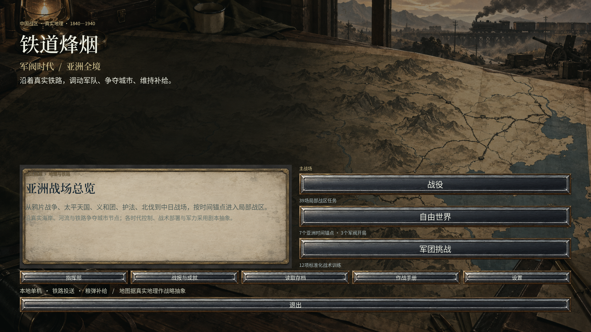

*当前导出程序的完整视口截图。本文 PNG 均来自原生画面，未拼接、补绘或叠加宣传文字。*

<a id="contents"></a>
## 目录

- [当前版本与内容规模](#status)
- [实机画面与 GIF](#screenshots)
- [菜单与战场界面](#menus)
- [开始游玩与操作](#play)
- [回合、战斗与胜利](#combat)
- [兵种、将领与成长](#army)
- [城市、经济、补给与外交](#economy)
- [地图、地表与历史边界](#geography)
- [完整内容与时间线](#content)
- [保存与设置](#saves)
- [源码运行与双端导出](#development)
- [架构、测试与性能](#engineering)
- [美术来源、媒体与许可](#assets)
- [已知不足与后续方向](#limits)
- [文档导航](#docs)

<a id="status"></a>
## 当前版本与内容规模

以下数量来自当前运行数据，不把设计清单、旧版本或未落地计划重复计入。规则版本为 **schema 2 / ruleset 9**。

| 内容 | 当前数量与范围 |
| --- | --- |
| 历史战役 | **39 场**：18 场 1920 / 1922 / 1924 军阀战役 + 21 场亚洲年代战役 |
| 征服／自由世界 | **10 个入口**：3 个军阀时代征服起点 + 7 个亚洲时间锚点 |
| 军团挑战 | **12 项**，开局按预算编组，使用标准化成长配置 |
| 全部剧本 | **61 个**，名称、登记日期、地图和回合上限见[剧本索引](docs/SCENARIO_INDEX.md) |
| 地图 | **6 张**：京津、京奉、中国东部、汉口、南京—浦口、亚洲战略层 |
| 军队 | **13 类基础兵种、3 类精锐变体**；可征募范围受年代和剧本限制 |
| 势力与人物 | **47 个势力定义、29 位将领定义**；在场和可选范围由剧本限定 |
| 成长 | **28 项科技、9 个被动战法、9 个主动战法、24 项成就** |
| 城市设施 | **12 类**，覆盖生产、交通、补给、医疗、城防、通信与贸易 |
| 栅格美术 | **1,176 张 PNG**；**990 张存储地图资源、970 张当前启用地图资源**；64 张四向单位图、16 张普通步兵动作图 |
| 地域地表 | **20 类 ×（1 张新连续底材 + 4 张细节原图）= 100 张启用原图**；另保留 20 张旧底材，图鉴可逐张切换 |
| 声音与字体 | 14 个程序音效、3 首本地 YuE2 配乐（每首180秒）、3 段保留兼容循环、2 个附带 OFL 许可的中文字体 |
| 本版回归 | **27 组、5,084 项检查通过**；另有216项原生地表、212项界面操作/布局、84项海岸、44项材质像素、11项光影夹具、10项裁切夹具、220项图符及18项配乐播放检查 |
| 双端状态 | Windows 导出已原生运行；APK 已检查签名、架构、权限与资源；X30 物理设备验收待完成 |

`content/` 是当前运行数据入口；原始设计和旧版本保留各自历史语境。数量完成不等于全部美术、历史、平衡或设备验收完成，详见[当前完成度](docs/23_当前完成度评估.md)。

<a id="screenshots"></a>
## 实机画面与 GIF

### 战场总版面

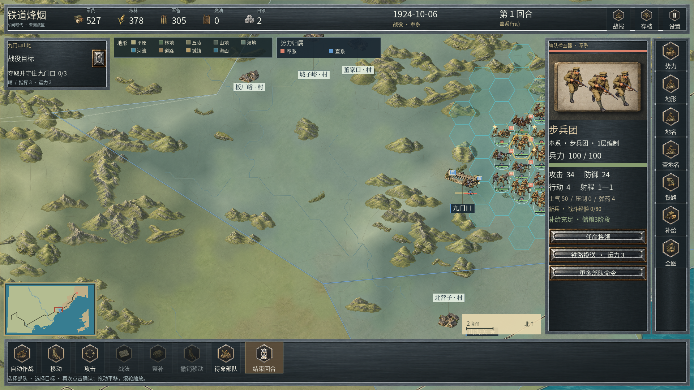

*Windows 原生战场：顶栏管理资源和日期，左上显示目标，右侧展示选中对象，底栏预览与确认命令。*

### 二十类地表的材质形态

0.2.21按真实陆地裁切连续底材，补上城市、道路与岸边底纹；落叶、落针仅在有林地依据处使用。20类材质可在图鉴查看，当前亚洲1927落图19类。另新增三首本地YuE2配乐，每首180秒，菜单、推演与交锋共享主题，以2.4秒淡化衔接。见[源陆地补纹](docs/38_源陆地补纹与林底选材约束.md)与[配乐试听和说明](docs/39_本地YuE2纯器乐配乐与场景衔接.md)。

| 配乐试听 | 使用场景 | 编配方向 |
| --- | --- | --- |
| [山河余烬 · 3分钟](docs/audio/01_menu_embers.mp3) | 主菜单与模式选择 | 72 BPM，拨弦与室内弦乐陈述主题 |
| [江流与驿路 · 3分钟](docs/audio/02_strategy_rivers.mp3) | 地图、外交与补给推演 | 80 BPM，竹笛、疏朗拨弦与柔和弦乐 |
| [铁路线上的交锋 · 3分钟](docs/audio/03_battle_railfront.mp3) | 伤害、部队覆灭与夺城事件 | 96 BPM，低音弦乐、克制鼓点与铜管 |

三首均按纯器乐谱面制作，未编写或叠加台词、歌词与旁白。游戏使用48 kHz双声道压缩OGG；24位WAV、320 kbps MP3、原始FLAC和生成/母带记录随源码保存。18项导出程序播放检查通过；主观听辨与手机扬声器验收另外记录。

0.2.20 新生成并启用 **20 张独立连续底材**。温带草叶、干草纤维、林底落叶、针叶、砂纹、砾石、盐壳、苔藓和岩板各有可辨形态，改善此前多类底纹都呈现相似斑驳颗粒的问题。全部采用指定 Sub2 路线，20 张原图已逐张完整查看；旧 20 张底材连同提示词和来源保留。地理分配继续依据既有生态区、高程与河谷，规则地形仍为 12 类。见[二十类地表材质形态重制](docs/37_二十类地表材质形态重制.md)。

### 连续地表光影与细河

0.2.19 将既有源高程光照改为连续取样，减轻三角明暗拼块；细河使用低饱和水床和半透明岸带。20 类地表仍各有一张连续底材与四张细节原图，按真实来源选材。实现、原生对照和精度范围见[连续高程光影与细河岸带](docs/36_连续高程光影与细河岸带.md)。

### 区域视角与选中部队

本版沿用按缩放切换的城镇和单个编队图符。区域视角让出地表和河道，近景恢复完整建筑、兵种原图与状态；选中或正在战斗的对象优先恢复完整模型。每个图符仍对应原部队，编制、数量和地理位置不变。


图符可直接点选；小图符优先于较大的城市吸附范围，避免选错邻格。完整手绘地景可用时不再重复叠加旧山林线符。实现与验证范围见[地图缩放层次与精确点选](docs/35_地图缩放层次与精确点选.md)。

### 真实行军与交战录像

以下 GIF 和完整 MP4 保留 **0.2.12** 的原始录像身份，用于展示真实命令、移动与战斗流程；不作为当前地图的画面证据。新地表与界面截图来自当前 EXE。

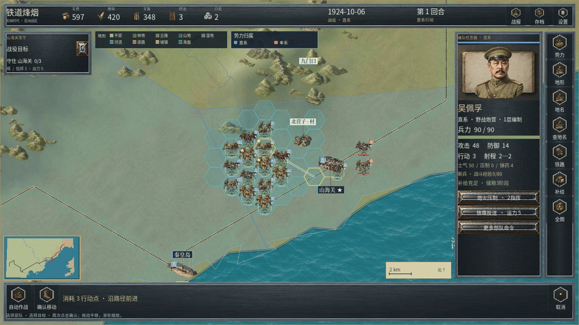

*行军片段：原生录像 0.5—7.5 秒，12 FPS，完整画幅缩放至 960×540，正常速度循环。*

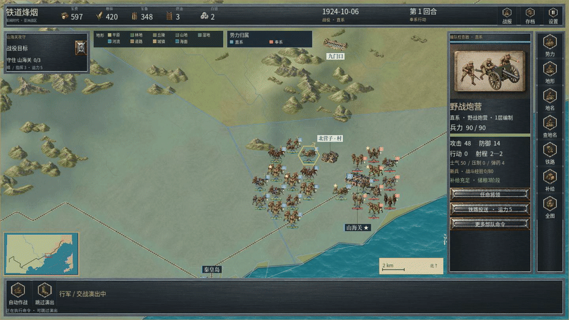

*交战片段：原生录像 15—23 秒。随机骰、攻击和受击来自已提交的真实命令；GIF 无声音。*

[完整 26.2 秒原生 MP4（含声音）](reports/atlas_v2_native_final.mp4) · [媒体来源、SHA-256 与转换参数](docs/media/manifest.json)

录像由 Godot MovieWriter 输出，演示脚本在未改部署的正式战役中提交合法命令，包含 AI 行动；命令重放已核对到相同最终状态与随机流。这是受控的实机功能演示，不是玩家手动通关录像。

### 地格与地理细节

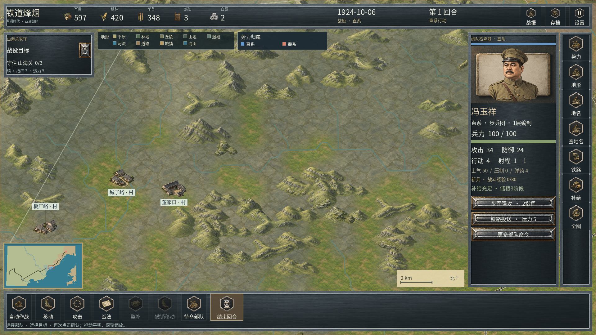

*燕山区域的丘陵、山体、村落和草土地表。势力颜色以半透明控制层覆盖地形。*

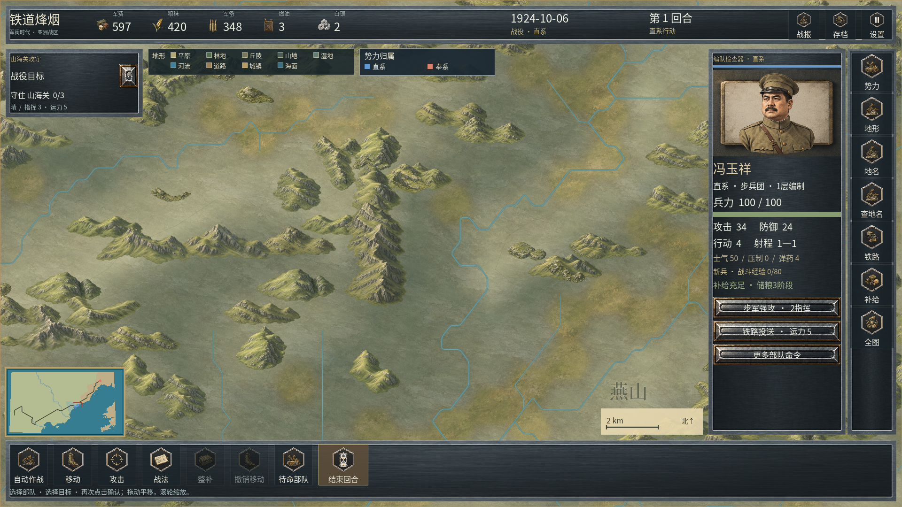

*来源支流按尺度显示；主河使用渐变河岸与连续水纹，细溪采用抗锯齿描线。显示层与规则中的河流、渡点分别管理。*

<details>
<summary>更多完整原生截图：海岸、沙地、砾地、湿土、长江、编组与手机布局</summary>


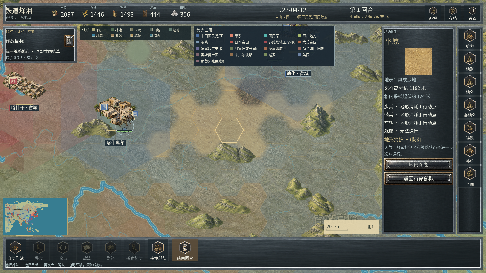

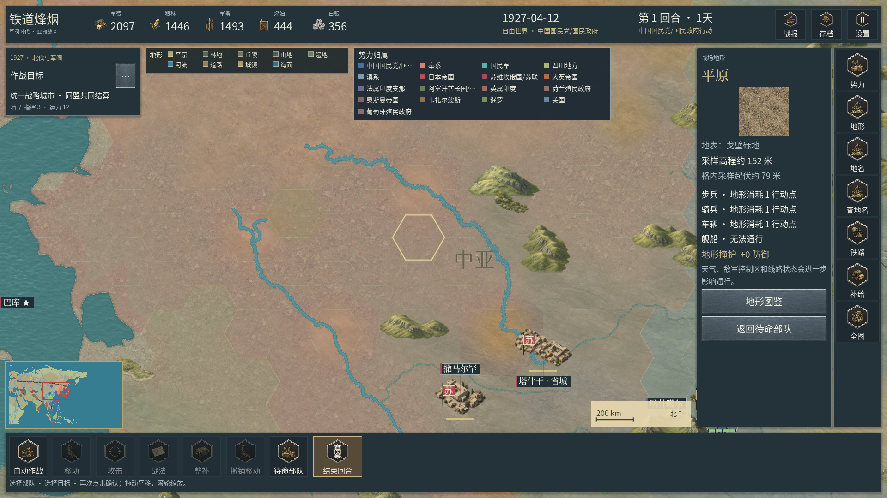

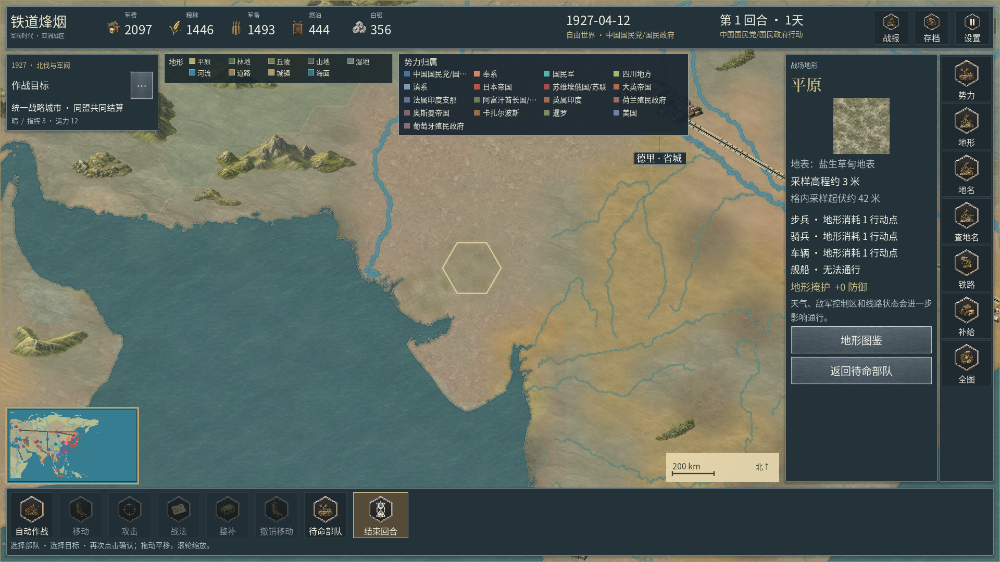

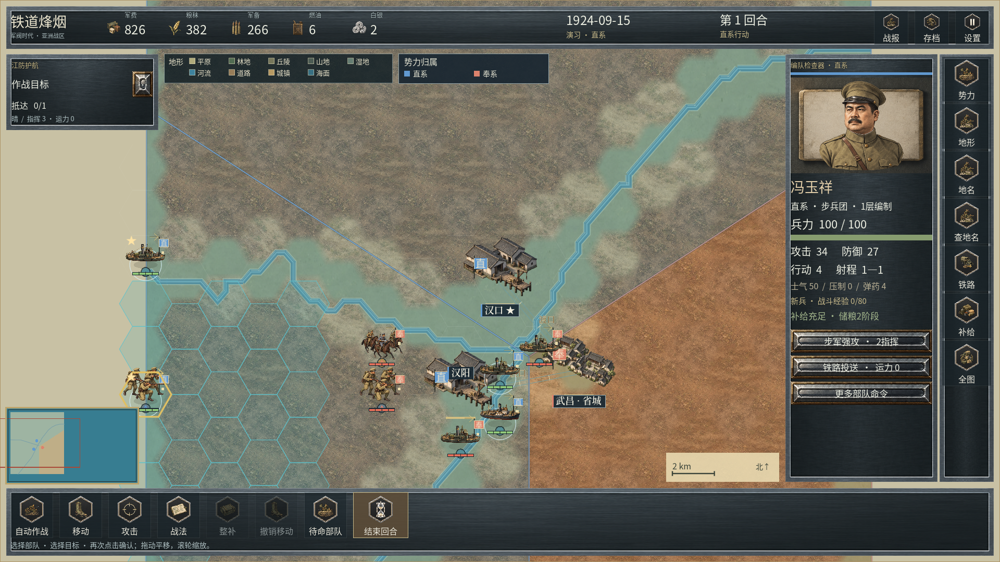

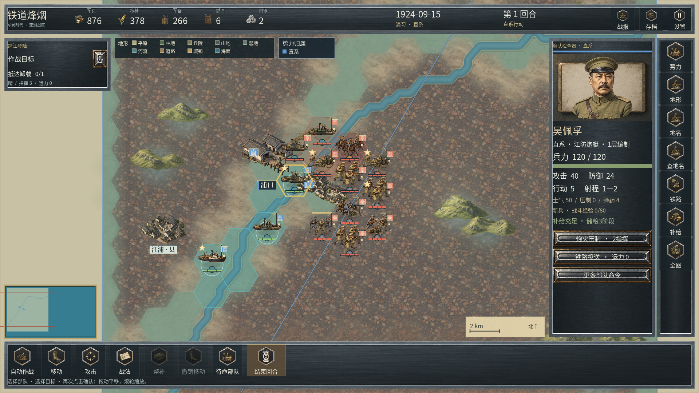

*0.2.15 只调整水系呈现：原始端点保留，汉口与南京的 31 条替代主河采用既有 60 米有界圆角，确有上下游关系且共用端点的河段共享接头方向。河宽为制图符号，非实测岸线。*

0.2.16按源陆地裁切亚洲城市影响区与沿海控制格，缩略图共享同一网格，里海水面保留真实岛屿。详见[真实海岸与控制区裁切](docs/33_真实海岸与控制区裁切.md)。

**0.2.17** 将地表改为不重叠的连续混合，减少同类材质内部的接缝；各地图总览通过缓存保留地域底材，并移除亚洲城市影响色与整片控制色的重复覆盖。保留20类、100张专用地表原图，新增栅格图为0。另通过44项原生材质像素检查，详见[连续地表与控制色去重](docs/34_连续地表混合与控制色去重.md)。

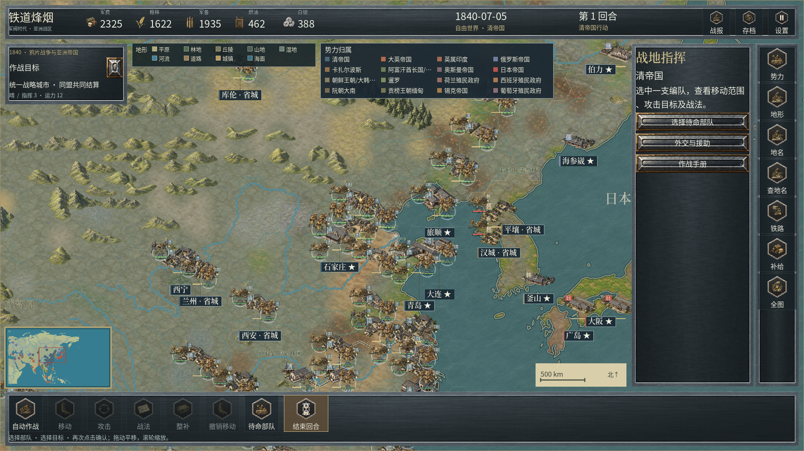

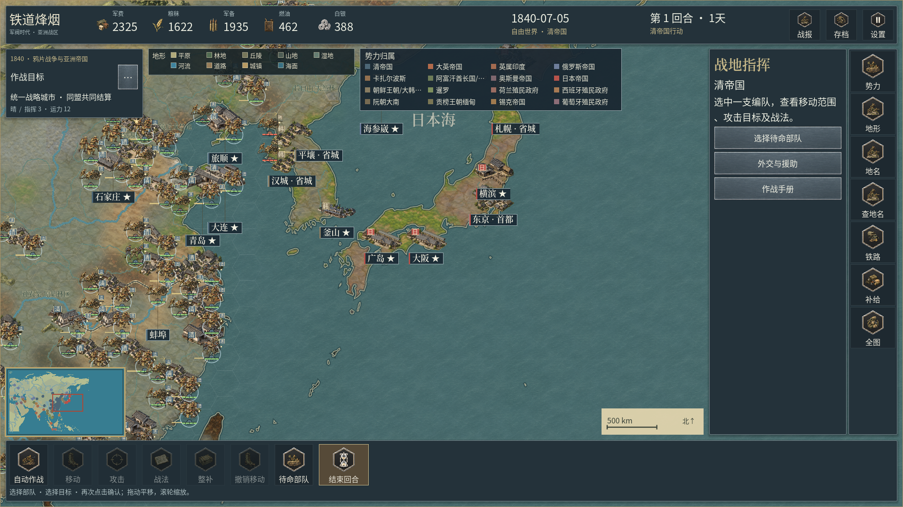

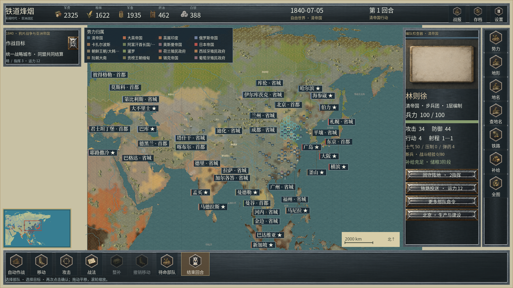

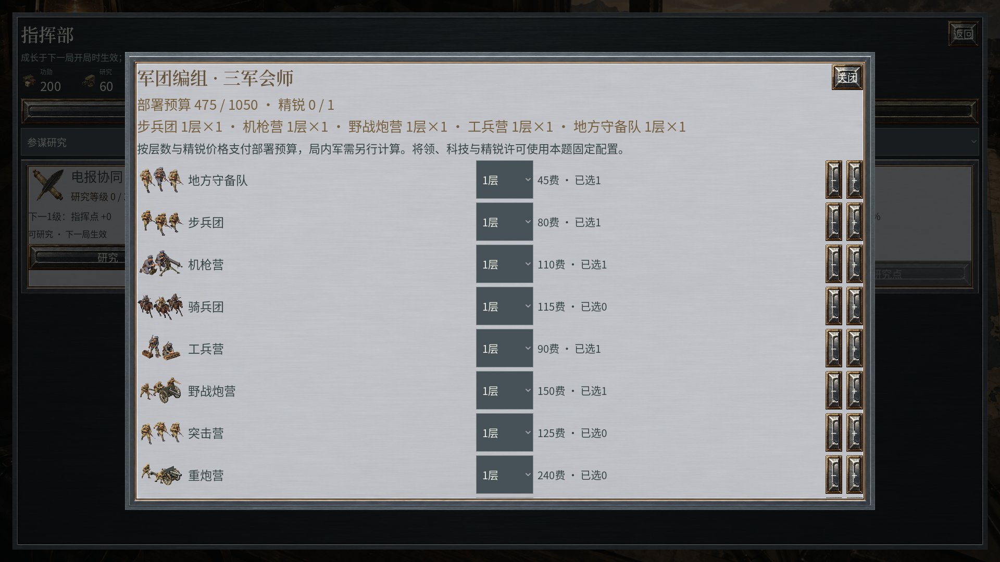

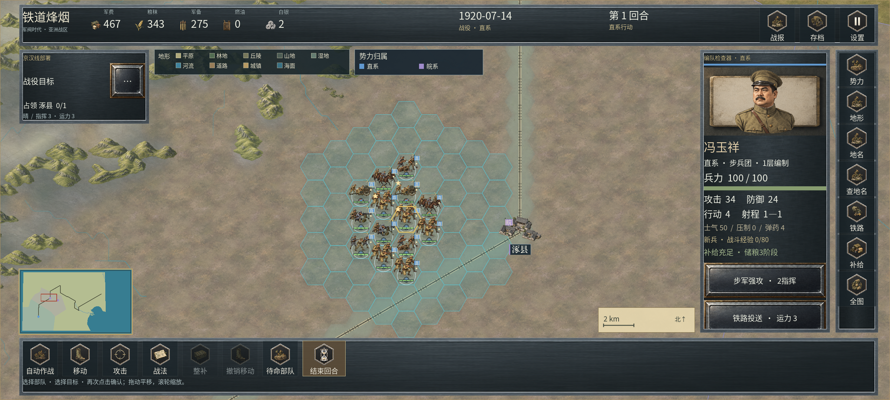

最后一图为 **Windows 上的 2400×1080 移动 UI 布局验证**，不是 Motorola X30 手机截屏，也不代表手机帧率、触控或温度结果。

</details>

<a id="menus"></a>
## 菜单与战场界面

以下为当前程序的菜单结构示意，实际美术外观见截图。

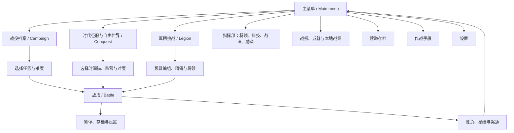
```mermaid
flowchart TD
    Home[主菜单 / Main menu] --> Campaign[战役档案 / Campaign]
    Home --> World[时代征服与自由世界 / Conquest]
    Home --> Legion[军团挑战 / Legion]
    Campaign --> Mission[选择任务与难度]
    World --> Faction[选择时间锚、阵营与难度]
    Legion --> Draft[预算编组、精锐与将领]
    Mission --> Battle[战场 / Battle]
    Faction --> Battle
    Draft --> Battle
    Home --> HQ[指挥部：将领、科技、战法、勋章]
    Home --> Records[战报、成就与本地战绩]
    Home --> Saves[读取存档]
    Home --> Manual[作战手册]
    Home --> Settings[设置]
    Battle --> Pause[暂停、存档与设置]
    Battle --> Result[胜负、星级与奖励]
    Result --> Home
```

| 区域 | 实际作用 |
| --- | --- |
| 顶部资源栏 | 军费、粮秣、军备、燃油、白银、日期、回合与行动阵营 |
| 左侧任务卡 | 当前目标、进度、回合条件与战役说明 |
| 地图中央 | 点选地格、部队、城市与聚落；查看可达范围、路径和目标 |
| 右侧对象面板 | 兵力、行动点、射程、弹药、士气、压制、经验、补给和命令 |
| 图层工具 | 势力、地形、地名、查地名、铁路、补给与全图 |
| 左下小地图 | 战区定位和点击跳转 |
| 底部命令栏 | 预览、确认、取消、自动作战、结束阶段和跳过演出 |
| 交战小窗 | 攻防双方、骰面、攻击、受击和反击，可关闭或跳过 |

战役、征服与军团入口使用真实地图预览，支持年代、难度和阵营筛选，显示解锁条件、星级与任务目标。主菜单战役数已与实际 **39 场** 对齐。征募、建筑、将领任命、外交和指挥部使用卡片界面，费用与不可用原因来自实际命令校验；科技页包括完整七个分支。

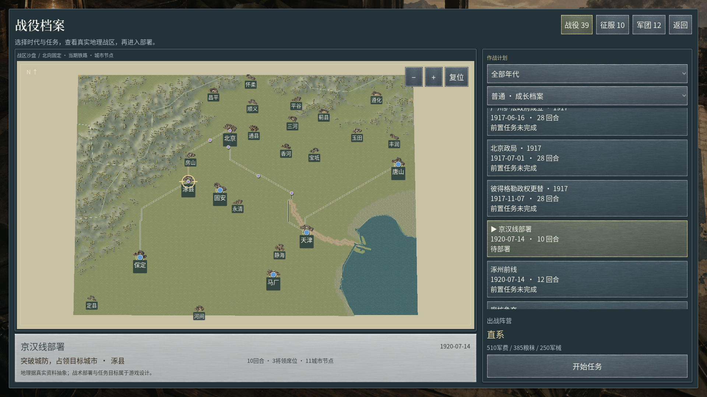

<details>
<summary>征募、城市建筑、外交与科技界面</summary>

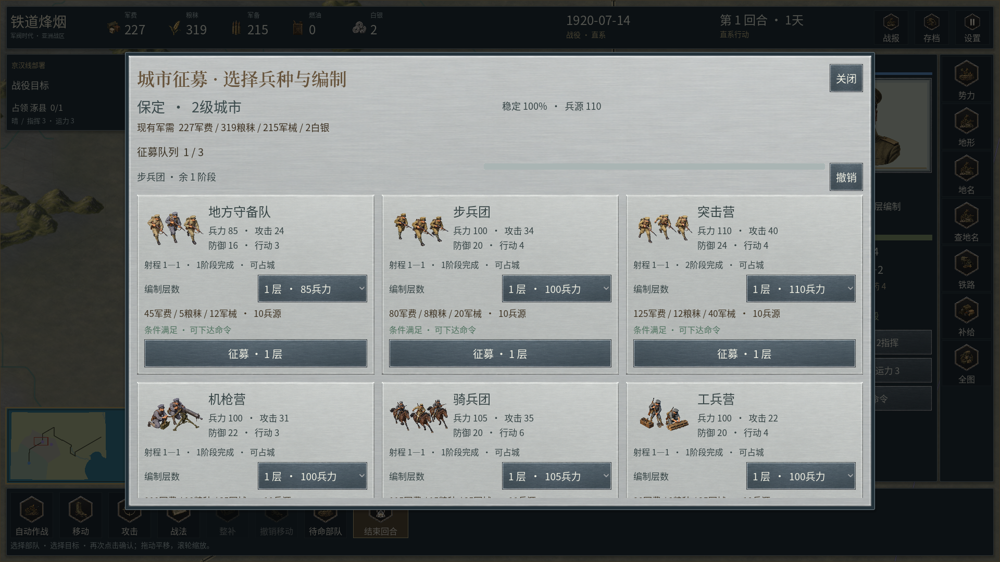

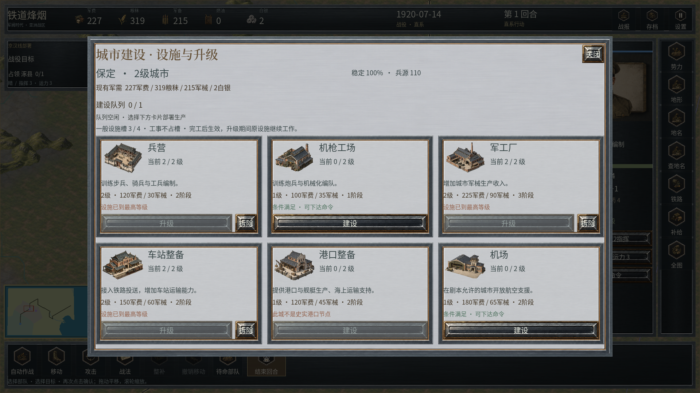

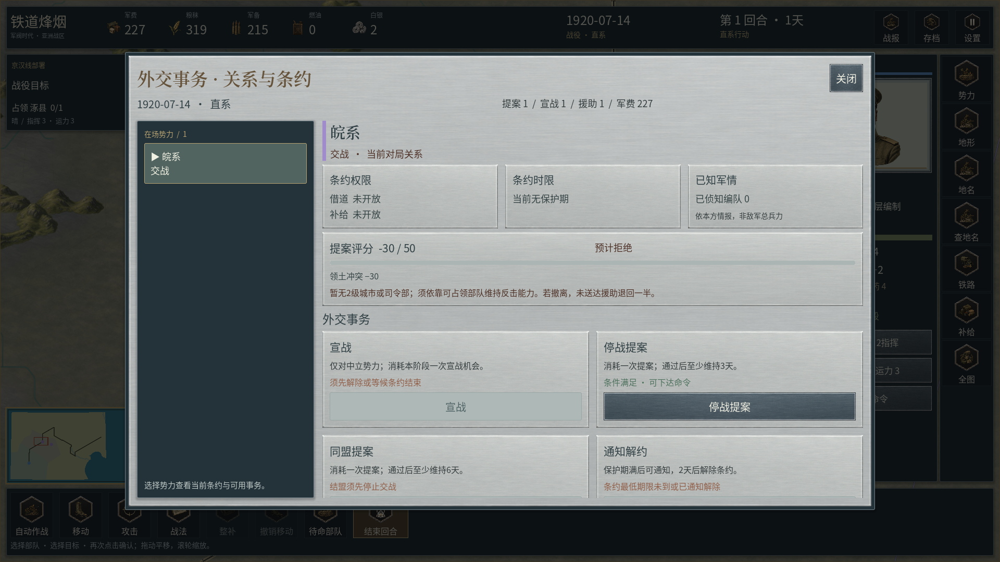

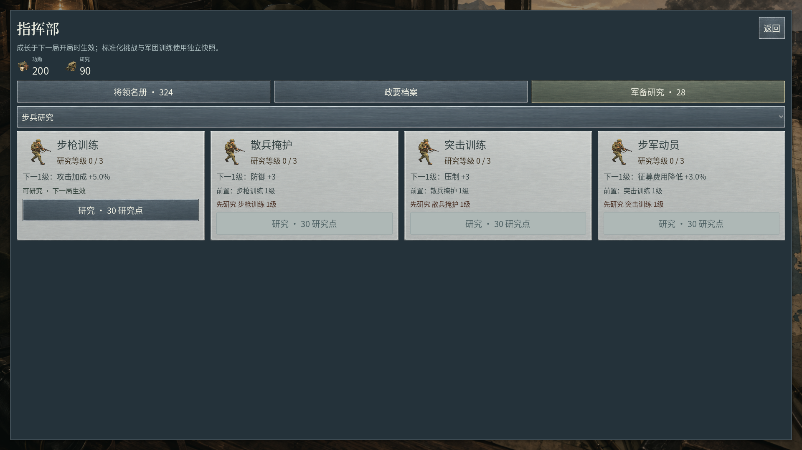

</details>

<a id="play"></a>
## 开始游玩与操作

| 平台 | 运行方法 | 当前范围 |
| --- | --- | --- |
| Windows | 已导出版本运行 `build/windows/RailwayWarlords.exe` | x86_64，资源嵌入；玩家无需安装 Godot 或 Python |
| Android | 安装自行导出的 `build/android/RailwayWarlords.apk` | 横屏，ARM64 / ARMv7，最低 Android 7.0 / API 24；当前验证包 target SDK 36 |
| Godot 编辑器 | 导入根目录 `project.godot`，等待资源导入，按 **F5** | Godot 4.7.2、Compatibility 渲染器 |

仓库保留完整源码和运行资源；EXE、APK、引擎缓存与私有签名不随 Git 提交。原始 PNG 约 2.13 GiB，首次克隆和导入需要预留时间及数 GB 磁盘空间；本地交付包独立保留。

### 第一局建议

1. 进入“战役”，从已解锁首关开始，阅读目标和失败条件。
2. 选择炮兵与敌方目标，查看伤害／反击预览，再点击底部确认攻击。
3. 击破城防并清除驻军，让具备占领能力的部队进入城市；炮兵无法直接占城。
4. 留意粮弹、补给和士气，用城市生产、铁路投送和工兵抢修维持战线。
5. 结束本方阶段，观察 AI 按相同规则行动。结算后领取星级和成长奖励。
6. 在指挥部配置下一场的将领、科技和战法；旧战局的成长快照保持开局状态。

### 输入与快捷键

| 操作 | Windows | Android |
| --- | --- | --- |
| 选择部队／城市／地格 | 单击 | 单指点按 |
| 平移地图 | 拖动 | 单指拖动 |
| 缩放 | 滚轮 | 双指缩放 |
| 提交命令 | 选目标后确认；支持再次点同一目标确认 | 确认按钮／再次点选 |
| 下一支待命部队 | `Tab` | 界面按钮 |
| 结束阶段 | 空闲时按 `Space`，再确认 | 结束阶段按钮 |
| 跳过演出 | 演出中按 `Space` | 跳过演出按钮 |
| 取消／暂停 | `Esc` | 取消／暂停入口 |
| 铁路目的地 | 选中部队后按 `R` | 部队命令 |
| 将领配置 | 选中部队后按 `G` | 将领入口 |
| 补给图层 | `F` | 补给按钮 |
| 战略全图 | `M` | 全图按钮 |

<a id="combat"></a>
## 回合、战斗与胜利

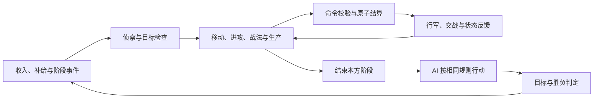
```mermaid
flowchart LR
    A[收入、补给与阶段事件] --> B[侦察与目标检查]
    B --> C[移动、进攻、战法与生产]
    C --> D[命令校验与原子结算]
    D --> E[行军、交战与状态反馈]
    E --> C
    C --> F[结束本方阶段]
    F --> G[AI 按相同规则行动]
    G --> H[目标与胜负判定]
    H --> A
```

- **移动**：加权六边格寻路，检查地形成本、控制区、可见信息、桥梁、渡口和线路。移动可分段，隐藏敌军按遭遇规则处理。
- **攻击**：每编队每阶段一次主攻击，消耗弹药，攻击后行动点归零。射程、克制、地形、当前兵力、士气、压制、将领与科技共同作用。
- **反击**：使用受击后的实际兵力和压制；普通部队每整回合一次，机枪有额外反击能力；仍需满足射程与城防限制。
- **城市**：城防和驻军独立记录生命。破防不等于易手，清除驻军后还需可占领部队进入。
- **随机骰**：预览只读且不消耗随机流；正式结算记录攻防骰、修正、伤害与反击。随机状态随存档保存，可重放核对。
- **视野**：地形视线、探索、侦察、最后目击与同盟共享控制情报，AI 使用可见信息并提交同一命令接口。
- **表现**：行军、持续朝向、炮弹、枪口、受击、飘字、击溃、占领、侦察／轰炸和骰面由实际状态事件驱动。

任务支持占领、连续守城、歼灭目标编队、俘获／击溃指定将领、护送、生存和抢修等目标。保护对象损失、主将受伤等失败条件优先处理；星级结合任务阈值和损失条件计算。

征服／自由世界围绕战略节点、阵营生存和同盟结算；到期按剧本积分。军阀征服通常为 80 回合，亚洲自由世界为 180 回合。推演日期是游戏日历，不是逐日战史。

难度包含普通成长、困难与标准化挑战；当前困难选项标注敌军攻击 +10%。军团以标准化成长开局，部署预算和城市生产军费分别记账。

<a id="army"></a>
## 兵种、将领与成长

| 基础兵种 | 主要任务与限制 |
| --- | --- |
| 地方守备队 | 低成本守点、补充战线与占领 |
| 步兵团 | 主力占城、守线与合击 |
| 突击营 | 突破与近距离进攻，受年代限制 |
| 机枪营 | 压制、据点防御与反击 |
| 骑兵团 | 高机动、侧翼、追击与占领 |
| 工兵营 | 线路抢修、工程与占领 |
| 野战炮营 | 远程压制和破防，不能占城 |
| 重炮营 | 重型远程火力，依赖生产与补给 |
| 装甲汽车队 | 机动和占领，受年代、地形与供给约束 |
| 装甲列车 | 铁路火力，依赖完整可用线路 |
| 江防炮艇 | 内河支援、护航 |
| 运输船 | 港口装载、航行与卸载，需陆军完成占领 |
| 沿海炮舰 | 沿海火力与岸轰 |

完整生命、攻防、行动、射程、造价与年代见[兵种数值表](docs/UNIT_REFERENCE.md)，以 [units.json](content/definitions/units.json) 为准。`stack` 是游戏编队层数，不能直接等同于历史某个营、团或旅。兵种还受剧本白名单限制。

29 位人物定义涵盖吴佩孚、张作霖、冯玉祥、阎锡山、林则徐、洪秀全、曾国藩、孙中山、蒋介石、李宗仁等。是否在场、所属阵营和可部署范围取决于年代剧本；专长和星级是玩法数值，肖像与归属仍需独立复核。

指挥部管理将领、军衔、主动／被动战法、勋章、科技和精锐解锁。局内经验支持晋升；长期成长在开局冻结为快照，局外升级不追溯改变进行中战局。奖励有去重账本，重复查看结果不重复领取。

三类精锐对应突击、骑兵、炮兵，具有章节与科技门槛。18 个战法涵盖炮火压制、步兵强袭、骑兵迂回、应急给养、铁路优先、侦察、筑垒、现场维修与协同射击。

<a id="economy"></a>
## 城市、经济、补给与外交

| 资源／指标 | 游戏用途 |
| --- | --- |
| 军费 | 征募、军饷、设施、维修与部分外交 |
| 粮秣 | 给养与持续作战 |
| 军备 | 征募、补员、弹药与维修 |
| 燃油 | 交通和机动压力；早期年代同样属于玩法抽象 |
| 白银 | 贸易、外交与储备 |
| 兵源 | 城市征募和补员容量 |
| 士气／压制 | 给养、受击与持续战斗能力 |
| 战争疲劳／合法性 | 经济收益和长期战争压力 |
| 殖民影响 | 港口、贸易与外交抽象 |

**城市**记录等级、城防、兵源、驻军与队列。12 类设施为兵营、机枪工坊、兵工厂、车站、港口、机场、补给站、医院、工事、电报站、贸易站、粮仓。一般设施限 4 槽，工事不占槽，可拆除腾位；部署位置被堵时完成的队列保留。

**铁路**同时校验势力运力池和全路径区间运力；敌方控制、损坏与通行权会影响投送。工兵按阶段维修，离开位置时暂停。铁路既运兵也影响补给，装甲列车依赖完整线路。

**补给**沿城市、道路、铁路与江海网络传播；断路和外交权限会改变补给状态，进一步影响行动、火力、弹药和士气。长期断粮可造成兵力损失。舰船装卸另有港口、行动与卸载地格约束。

**航空**来自允许建设机场的城市，检查出动数、范围、资源、弹药与天气，提供侦察和轰炸命令。

**外交**包含宣战、停战、同盟、通行、补给权、援助和贸易。结盟不直接转移城市所有权，共享胜利按关系图结算；玩家可从真实地理和年代起点改变后续进程。

以上构成经济—生产—运输—作战循环。资源、财政与政治数值服务于游戏平衡，不是历史统计，也尚未达到《欧陆风云》系列完整国家治理深度。公式与实现见[经济、物资与多元军队](docs/21_经济物资士气与多元军队.md)。

<a id="geography"></a>
## 地图、地表与历史边界

| 地图 | 总格数 | 城市节点 | 用途 |
| --- | ---: | ---: | --- |
| 京津 `jingjin` | 26,195 | 11 | 北京—天津与华北局部战区 |
| 京奉 `jingfeng` | 65,726 | 15 | 京奉铁路、山海关、渤海周边 |
| 中国东部 `conquest_china` | 74,762 | 55 | 军阀时代征服 |
| 汉口 `hankou` | 400 | 3 | 江防、护航和内河训练 |
| 南京—浦口 `ningpu` | 440 | 2 | 两岸运输、装卸与登陆训练 |
| 亚洲 `asia_strategic` | 7,668 | 81 | 亚洲大陆战略与相关任务 |

总格数包括陆地、水体与受限格，不能等同于可部署面积。京津、京奉和东部征服地图宽、高分别扩展五倍，基础操作蜂窝半径保持 **48 像素**。亚洲层范围 **20°E—180°E、10°S—80°N**，是大陆战略尺度，不是全亚洲村级地图，各地区细节密度也不相同。

- **海岸与主河**：Natural Earth 源几何；城市为真实坐标，铁路依年代资料。
- **细河网**：战术层增加 24,268 条细河段和 31 条主河替代显示段，共 24,299 条记录；亚洲层另保留 694 条来源细河段。按等级与缩放显示，不宣称全量小溪覆盖。
- **地形**：Tilezen／SRTM 等来源高程。亚洲层由 54 张原始 GeoTIFF、33,696 个登记采样点构建粗地形，格网名义半径 150 千米、采样支持范围 100 千米。
- **地表**：草土、旱草、岩土、林下土、湿土、水面、细沙、砾土、冲积土按来源生态区、高程和地理条件选材。
- **地景**：多种树冠、丘陵、山脊、高峰、岸线、露岩、芦苇和地区建筑，按脚点、坡向和空间排重放置。
- **聚落**：首都、省城、县城、集镇和村落分级；增加 67 处有来源的标记，随缩放显示，支持隶属和地方说明查询。
- **控制层**：半透明势力色保留地表，基础控制色场约 0.20—0.23，局部城市影响区覆盖为 0.26；随当前据点归属变化，不冒充精确历史军事边界。

地图资源从早期 74 张扩为 **970 张，约 13.11 倍**。0.2.12 的 796 张独立扩充图包含 **176 张地表、480 张地景、140 张建筑**；0.2.13 增加 **80 张地域细节原图**，0.2.14 再增加 **20 张连续绘制底材**。0.2.15 复用现有不可变水纹原图完善连续河面，本轮未增加 PNG。显示缩放、镜像、染色不计为新增原图。

20 类地表包括温带草甸、旱生草原、荒漠草原、风成沙地、戈壁砾地、盐生草甸、高山草甸、高寒草原、苔原、寒带腐殖层、温带落叶层、针叶层、亚热带湿润土、热带腐土、旱林灌丛底材、热带草原底材、洪泛草甸、河谷冲积地表、风化岩坡和峰岭碎岩。每类一张连续底材与四张细节原图，按生态区、高程与既有河谷选取，同类六邻格不复用同一张细节源图。势力归属以独立半透明层覆盖。

连续底材按世界坐标取样，跨格保持同一笔触位置；原四张细节纹理以战术 0.22 / 战略 0.14 强度叠加，减轻砂纸感和逐格斑块。主河与细河段采用统一河级宽度和连续明暗岸缘，宽度为制图符号。

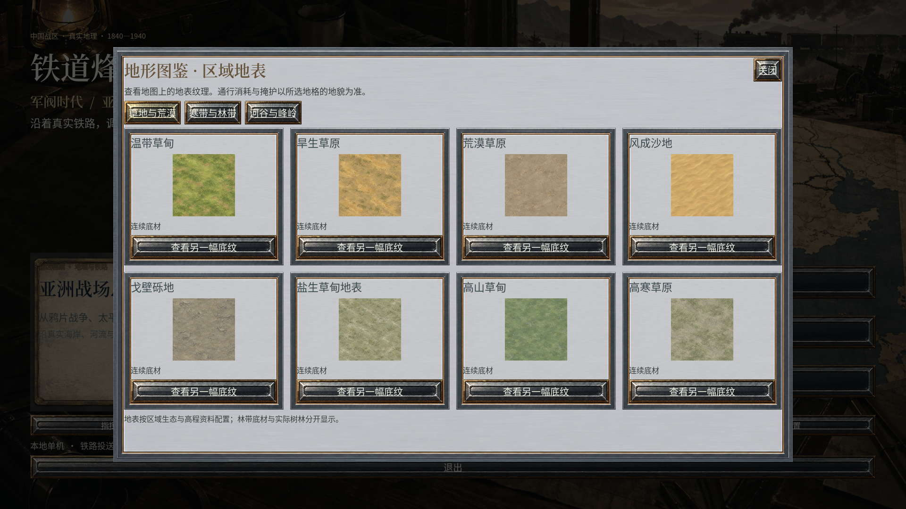

在游戏说明或地格详情中打开“地形图鉴”，可查看三页 20 类及每类一张连续底材和四张细节原图。它们属于地域地表表现；通行、掩护和水陆判定以格子实际规则地形为准。详见[20 类地表及来源门控](docs/30_二十类地域地表与纹理整改.md)、[连续地表](docs/31_连续地表与水系层次.md)和[本版来源河段与连续水面](docs/32_真实河段连续水面.md)。

真实地理、年代行政资料、人物和编制分别登记来源。现代潜在生态区只指导代表性材质，不能当作逐年历史森林、湿地或土地利用调查；现代水系不自动代表历史河道。生成建筑是地区符号，不是具名城市街区复原。

亚洲局部任务当前仍使用粗尺度战略节点，部分地点映射到邻近节点。兵力、`stack`、收入、天气、部署与目标是玩法数据；日期、人物装备、编制与起局控制仍需逐条复核。见[历史数据](docs/19_亚洲全境时间线与史实数据.md)、[地图依据](docs/07_历史地理与地图美术.md)、[地表与细水系](docs/29_地表材质与细水系.md)。

<a id="content"></a>
## 完整内容与时间线

**军阀战区**：18 场原有战役分为 1920、1922、1924 三组，并有相应东部中国征服。城市、铁路、补给和军事集团竞争是核心。1924 征服包含日期触发的北京政变与国民军状态变化，玩家后续结果遵循游戏规则。

| 亚洲起点 | 当前题材 | 阅读边界 |
| --- | --- | --- |
| 1840 | 清、英国与亚洲势力；鸦片战争任务组 | 组内任务延伸到 1841、1842，分组年份不是每关日期 |
| 1860 | 英法战事、北方通道与太平天国相关任务 | 战争、地区与阵营关系分别登记 |
| 1890 | 甲午前夜及延伸到 1894、1895 的任务 | 1890 不是义和团运动日期；日俄战争尚无独立完整战役组 |
| 1900 | 大沽、天津、北京与八国联军相关任务 | 不同阶段历史兵力不直接等同于游戏编队 |
| 1917 | 护法、北京政局与俄国政权变动 | 部分标题与登记日期仍待历史复核 |
| 1927 | 北伐、武汉、上海和江西相关任务 | 事件题材、作战日期与目标分别审查 |
| 1940 | 中国交通线、湖北与印度支那任务 | 装备、人物和部署按独立审核状态记录 |

每个亚洲时间锚有一个自由世界和三场任务，共 **7 个起点、21 场任务**。`province_scope` 最多三个省级／地区条目；它是任务编排范围，不表示已绘制全亚洲所有历史省界。当前记录 30 个 OOB 编制，保留兵力范围和来源状态，不补造无法确认的小队和军官。

12 项军团挑战训练合击、压制、工兵、补给、铁路、侦察、江防和跨江装卸，明确属于演习。全部名称、日期、地图和回合上限见[61 个剧本完整索引](docs/SCENARIO_INDEX.md)。

<a id="saves"></a>
## 保存与设置

- **保存**：5 个手动槽、3 个轮换自动槽；Android 切后台自动保存。损坏时尝试备份，内容／规则指纹不兼容时明确拒绝载入。
- **版本**：本版地形订正改变内容指纹，旧进行中战局使用对应旧版继续；成长档案另存，不保证所有战局跨版本兼容。
- **暂停**：弹窗打开时 AI 停止提交命令，后台结果按战局和版本校验，防止旧命令重复生效。
- **设置**：音乐、音效、独立音量、网格、演出速度、交战小窗、减少晃动和 100%／120%／150% 字号。
- **手机**：横屏、大按钮、安全区、拖动和双指缩放；Motorola X30 为目标样机，真机验收单列。
- **存储**：Windows 为 Godot `user://`，通常是 `%APPDATA%/Godot/app_userdata/铁道烽烟：军阀时代/`；Android 为应用私有目录。成就与战绩榜均在本机。
- **联网**：当前无多人或联网排行；APK 不申请网络、相机、麦克风和外部存储权限。

<a id="development"></a>
## 源码运行与双端导出

### 克隆和运行

使用原生 Windows 工具；项目禁止本地 Docker、WSL、虚拟机和 Android 模拟器。

```powershell
git clone git@github.com:wikigsroom/railway-warlords.git
Set-Location railway-warlords

# 将 Godot 4.7.2 原生控制台程序配置到 PATH，命名为 godot，或替换为绝对路径。
godot --headless --path . --editor --import --quit
godot --path . --editor
# 直接运行游戏：
godot --path .
```

无需 Git LFS。PNG 保留原始字节，`*.import` 保留导入参数，`.godot/` 在本机重新生成。运行核心游戏无需 Python、生成网关或原电脑私有配置。

### Windows

安装与引擎完全对应的 **Godot 4.7.2 官方导出模板**。项目的 `Windows` 预设使用 x86_64、Compatibility 渲染与嵌入式 PCK。

```powershell
New-Item -ItemType Directory -Force build/windows | Out-Null
godot --headless --path . --export-release "Windows" "build/windows/RailwayWarlords.exe"
```

预设未启用商业代码签名，正式发行时使用自己的签名流程。

### Android

配置原生 **JDK 21、Android SDK** 与对应导出模板，在 Godot 编辑器设置中填写本机 Java／SDK 路径。当前验证 APK 为 **minSDK 24 / targetSDK 36**，开启 ARM64、ARMv7，关闭 x86 模拟器目标。

```powershell
New-Item -ItemType Directory -Force build/android | Out-Null
godot --headless --path . --export-debug "Android" "build/android/RailwayWarlords-debug.apk"
adb install -r build/android/RailwayWarlords-debug.apk
adb shell monkey -p org.railwaywarlords.game -c android.intent.category.LAUNCHER 1
```

发布前在 Godot 私有导出凭据或环境变量配置自己的 release keystore、alias、密码，避免写进版本控制，再导出：

```powershell
godot --headless --path . --export-release "Android" "build/android/RailwayWarlords.apk"
```

应用 ID 为 `org.railwaywarlords.game`，当前 versionCode 17。覆盖更新必须使用相同签名；自行签名不能覆盖原签名安装。仓库的 release 凭据字段为空。

### 自动化工具的范围

`tools/` 包含构建、回归、地理编译、素材核验、录像与交付审查脚本，部分保留原工作区布局：

```text
workspace/
├── .toolchain/              # 原生引擎与私有签名
├── design/铁道烽烟/          # 原始设计与登记表
├── output/                  # 原图、地理原始档案与旧交付
└── game/railway_warlords/    # 本仓库原始位置
```

外部档案不属于独立克隆。`build_release.py` 等原工作区助手含机器路径，需要调整；从原始地理资料重建也需取得相应档案。独立克隆可用上面的 Godot 命令直接运行和导出，编译后地理数据及完整运行美术已经包含。依赖分层见[开发环境说明](docs/DEVELOPMENT.md)。

<a id="engineering"></a>
## 架构、测试与性能

```text
.
├── project.godot / export_presets.cfg
├── app/              # 菜单、HUD、战局控制与原生 QA
├── domain/           # 命令、战斗、移动、经济、补给、外交、胜负
├── ai/               # 使用同一命令接口的规划
├── content/          # 定义、地图、剧本与指纹
├── presentation/     # 六边图、地表、河网、精灵、动效、相机
├── persistence/      # 战局、成长、备份与事务保存
├── audio/            # 事件音频与程序音频
├── assets/           # 完整原图、声音、字体、导入参数与来源
├── schemas/          # 数据契约
├── tests/            # 规则、事务、地理、输入与表现检查
├── tools/            # 原生工具、编译、验证和媒体准备
├── reports/          # 选入仓库的验证快照和原生录像
└── docs/             # 程序文档、媒体、来源索引与提示词
```

界面和 AI 只提交命令，预览只读。`CommandKernel` 校验版本、阵营、目标、费用与合法性，在独立事务中原子执行，再返回状态和事件。规则、AI 和存档 I/O 使用串行原生后台队列，主线程核对战局代号与版本后提交；地图平移、缩放保持独立。见[架构与模块](docs/02_架构与模块.md)。

### 回归与验证

```powershell
godot --headless --path . --script tests/run_tests.gd
godot --headless --path . --script tests/acceptance_test.gd
godot --headless --path . --script tests/transaction_test.gd
godot --headless --path . --script tests/asia_content_test.gd
godot --headless --path . --script tests/map_bank_test.gd
godot --headless --path . --script tests/surface_geography_test.gd
godot --headless --path . --script tests/terrain_surfaces_test.gd
```

27 组、5,084 项覆盖规则、输入、地理、成长、事务、事件、渲染、后台、比例、物流、缓存、聚落、快照、亚洲内容、边界、朝向、地表、素材库、河段连续性、沿海控制网格与源陆地补纹。当前 EXE 另通过两视口216项地表、三视口212项实际UI操作与布局、两视口84项海岸及44项原生材质夹具检查。地图图符专项另通过220项，核对独立编队、双向跨缩放阈值、邻城点选与完整状态/RNG不变性。90张地表/UI、20张控制开关和32张图符画面合计142张当前EXE原生截图。另有11项光影及10项源陆地裁切原生检查；4张光影与4张裁切数值夹具画面单列，不作为历史地图截图。三首配乐通过18项最终EXE播放检查。旧版四向行军、步兵动作和命令重放证据保留原版本身份。

[测试清单](docs/05_测试与验收.md) · [源依赖与报告绑定](reports/regression_dependency_evidence.json) · [当前原生证据](reports/terrain_surface_native_evidence.json) · [当前验证摘要](reports/terrain_update_verification_summary.json)

当前报告是原工作区 0.2.21 验证快照，不表示读者电脑已经重跑，也不替代人工玩法、美术、音乐听辨、历史和设备验收。完整 AI 长局未在本轮补丁重跑，旧长局与旧录像结果保留原版本身份。

### 0.2.21 当前满载实测

本版最终 EXE，桌面 RTX 3060，240 支部队、74,762 地格。两个视口各完成 60 秒持续平移缩放，其余阶段使用固定帧或实际战斗演出。两列均为桌面 GPU 测试。

| 阶段 | 1920×1080 平均 FPS / P95 毫秒 | 2400×1080 桌面移动布局平均 FPS / P95 毫秒 |
| --- | ---: | ---: |
| 全图静止 | 347.1 / 4.32 | 291.5 / 4.33 |
| 全图平移 | 138.9 / 9.48 | 138.7 / 10.35 |
| 战术选中 | 76.4 / 41.68 | 73.3 / 41.33 |
| 持续平移缩放 | 147.2 / 8.66 | 142.5 / 9.11 |
| 战斗演出 | 108.0 / 9.01 | 112.3 / 8.97 |

两种布局的全部阶段均通过既有平均 60 FPS 门槛。战术选中 P95 为 41.68 / 41.33 毫秒，存在瞬时尖峰，不能解释为每帧稳定 60 FPS；2400×1080 的结果不能代替 Motorola X30 真机验收。[当前 Windows 结果](reports/capacity_windows_v0221.json) · [当前安卓比例桌面结果](reports/capacity_x30_v0221.json)。[0.2.20 Windows](reports/capacity_windows_v0220.json)、[0.2.20桌面移动布局](reports/capacity_x30_v0220.json)及下方0.2.19失败记录保留原版本身份。

### 0.2.19 中间版本性能历史记录

0.2.19 EXE，RTX 3060，240支部队、74,762地格。两视口持续平移缩放各60秒；其余阶段为固定帧或已结算战斗演出样本，均使用桌面GPU。

| 阶段 | 1920×1080 平均 FPS / P95 毫秒 | 2400×1080 桌面移动布局平均 FPS / P95 毫秒 |
| --- | ---: | ---: |
| 全图静止 | 289.9 / 5.83 | 303.7 / 4.58 |
| 全图平移 | 132.7 / 10.29 | 140.2 / 9.56 |
| 战术选中 | 76.5 / 41.34 | 62.1 / 47.41 |
| 持续平移缩放 | 129.8 / 10.43 | 85.6 / 16.00 |
| 战斗演出 | 86.5 / 12.62 | 53.8 / 18.38 |

Windows布局通过；桌面移动布局战斗阶段平均53.8 FPS，未通过既有平均60 FPS门槛，因此本中间版本不作为通过验收的发行包交付。[Windows结果](reports/capacity_windows_v0219.json)与[未达标的桌面移动布局结果](reports/capacity_x30_v0219.json)均保留。这些结果不是Motorola X30真机性能。

### 0.2.15 桌面性能历史样本

RTX 3060、关闭 VSync，最大负载含 240 支部队。持续平移缩放各测 60 秒，其他为固定帧样本；两列均为 Windows 原生导出程序。

| 阶段 | 1920×1080 平均 FPS / P95 毫秒 | 2400×1080 桌面移动布局平均 FPS / P95 毫秒 |
| --- | ---: | ---: |
| 静态战略图 | 403.0 / 3.56 | 380.7 / 3.71 |
| 战略平移 | 157.3 / 8.90 | 160.1 / 8.52 |
| 战术选中 | 75.2 / 39.32 | 70.6 / 39.65 |
| 持续平移缩放 | 189.9 / 7.11 | 164.0 / 8.96 |
| 战斗演出 | 142.0 / 7.58 | 131.3 / 8.24 |

战术选中仍存在帧耗时尖峰，平均 FPS 不代表每帧稳定。这些不是 X30 真机数据。见[容量性能与渲染等价](docs/12_容量性能与渲染等价.md)。

<a id="assets"></a>
## 美术来源、媒体与许可

1,176 张注册 PNG 通过指定 **sub2-image-gen / gpt-image-2.5** 路线生成，包含保留的 20 张旧底材。引擎副本保持原始生成字节，压缩、mipmap 和显示尺寸由 Godot 导入管理。未通过裁切、补绘、拼接、手工缩放或镜像计数扩充源图数量。

- [运行素材登记](assets/manifest.json)：原工作区来源、模型、尺寸与哈希。
- [独立仓库来源索引](docs/asset-provenance/index.json)：每张运行图和提示词在本仓库的相对路径及 SHA-256。
- [提示词目录](docs/asset-prompts/)：1,176 份生成提示词；生成网关和凭据不随仓库提供。
- [媒体说明](docs/MEDIA.md)：原生截图、录像、GIF 参数与真实性边界。
- [地图扩充与排重](docs/28_地图素材扩充与去重.md)、[地表和细水系](docs/29_地表材质与细水系.md)：材质选取与来源精度。

引擎、字体和地理资料遵守各自许可。Natural Earth、HydroRIVERS／HydroSHEDS、生态区、高程及其他地理资料条款见 [assets/legal](assets/legal/)，字体许可见 `assets/font/OFL*.txt`。HydroSHEDS 有独立使用条款，不因源码公开而成为公共领域。

项目当前**尚未指定覆盖全部原创代码与美术的开源许可证**；发布源码不自动授予 MIT／Apache 等许可。见[许可说明](LICENSE-NOTICE.md)。参考游戏名称只用于设计比较，不表示关联或授权。

<a id="limits"></a>
## 已知不足与后续方向

| 当前边界 | 后续工作 |
| --- | --- |
| 地图资源扩充，商业级逐画面美术签核未完成 | 边缘套件、季节、地点专属地貌、街区与桥港 |
| 四向单位图，完整动作主要覆盖普通步兵 | 其他兵种动作、装填、阵亡和更多朝向 |
| 亚洲大陆层控制色已按源陆地裁切，部分任务仍使用粗节点 | 细化战区、当时区划和部署，改善单位/城市聚集、山脚衔接和专属地貌 |
| 来源和玩法数值已分开登记 | 日期、标题、人物装备、编制与控制线逐项复核 |
| 循环可玩，全部关卡未完成人工策略平衡 | 胜负路径、弱势阵营、经济节奏与难度 |
| X30 尺寸桌面布局通过检查 | 物理 X30 安装、触控、GPU、温度、续航与长局 |
| 战术选中存在帧耗时尖峰 | 降低大图选中、范围预览与提交峰值 |
| 中文 UI，部分旧文案 | 文案清理、完整英文游戏本地化和引导 |
| 工具保留外部档案／机器路径依赖 | 工具链和地理重建参数化 |

以上待办没有计为完成；完整发行门槛、有限范围测试交付和旧版本状态分别保留。

<a id="docs"></a>
## 文档导航

| 主题 | 文档 |
| --- | --- |
| 入门 | [程序文档总索引](docs/00_程序文档索引.md)、[运行与操作](docs/01_运行与操作.md) |
| 内容与数值 | [全部剧本](docs/SCENARIO_INDEX.md)、[兵种数值](docs/UNIT_REFERENCE.md) |
| 开发与导出 | [独立仓库开发](docs/DEVELOPMENT.md)、[双端构建](docs/06_双端构建与发布.md) |
| 实现 | [架构](docs/02_架构与模块.md)、[后台规则](docs/13_后台规则与响应性.md) |
| 地图 | [地理依据](docs/07_历史地理与地图美术.md)、[五倍格网](docs/14_地图比例与五倍格网.md)、[历史聚落](docs/15_历史聚落与势力地图.md) |
| 亚洲 | [史实数据](docs/19_亚洲全境时间线与史实数据.md)、[战役与自由世界](docs/20_亚洲战役系统与自由世界.md) |
| 经济与成长 | [物资士气](docs/21_经济物资士气与多元军队.md)、[养成事务](docs/08_养成与事务回归.md) |
| 视觉对标 | [EW6 改版](docs/16_欧陆战争6对标与美术改版.md)、[地图差距](docs/25_欧陆战争6地图资源差距评估.md)、[UI 结构](docs/26_欧陆战争6_UI结构与视觉对标.md) |
| 当前美术 | [20 类材质形态重制](docs/37_二十类地表材质形态重制.md)、[连续地表与控制色](docs/34_连续地表混合与控制色去重.md)、[真实海岸控制区](docs/33_真实海岸与控制区裁切.md)、[真实河段连续水面](docs/32_真实河段连续水面.md)、[20 类地域底纹](docs/30_二十类地域地表与纹理整改.md)、[动作](docs/27_动作关键帧与地格详情.md)、[素材库](docs/28_地图素材扩充与去重.md)、[地表水系](docs/29_地表材质与细水系.md) |
| 验证范围 | [完成度](docs/23_当前完成度评估.md)、[测试与验收](docs/05_测试与验收.md) |
| 媒体与来源 | [截图和 GIF](docs/MEDIA.md)、[素材来源](docs/asset-provenance/index.json)、[许可](LICENSE-NOTICE.md) |

历史章节保留版本语境；当前状态以本 README、0.2.21 完成度和对应报告为准。
